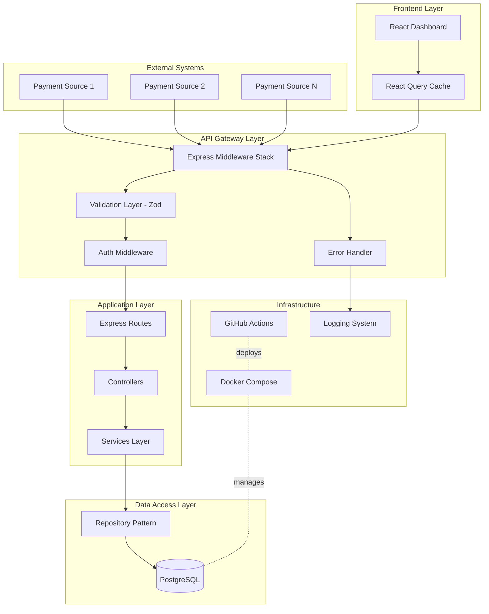

# Merchant Transaction Portal - System Architecture

## Overview
The Merchant Transaction Portal is a full-stack application designed to ingest, store, and analyze merchant transactions from multiple payment sources via webhooks. The system provides a RESTful API for transaction management and a React-based dashboard for visualization and analytics.

## Component Diagram



## Data Flow

### Webhook Ingestion Flow
```
1. External Payment Source → POST /webhooks/ingest
2. Express Middleware Stack:
   - Body Parser (JSON)
   - Request ID Generator
   - Request Logger
3. Validation Layer (Zod Schema):
   - Validate payload structure
   - Validate required fields (source, merchant_id, amount, currency, status, transaction_id)
   - Type coercion and sanitization
4. Webhook Controller:
   - Extract validated data
   - Call WebhookService.ingestTransaction()
5. Webhook Service (Business Logic):
   - Begin DB transaction
   - Validate merchant exists (or create if needed)
   - Create transaction record
   - Log webhook request/response in webhook_logs
   - Commit transaction
6. Response → 201 Created (with transaction ID)
7. Error Handling:
   - Validation errors → 400 Bad Request
   - DB errors → 500 Internal Server Error
   - All errors logged to webhook_logs
```

### Transaction Query Flow
```
1. React Dashboard → GET /transactions?filters
2. Express Middleware Stack:
   - Authentication (future: JWT validation)
   - Query Parameter Validation (Zod)
3. Transaction Controller:
   - Parse and sanitize query params
   - Call TransactionService.getTransactions(filters)
4. Transaction Service:
   - Build dynamic SQL query with filters
   - Apply pagination (default: 50 records)
   - Execute via TransactionRepository
5. Transaction Repository:
   - Execute parameterized SQL query
   - Map database rows to domain objects
   - Return paginated results with metadata
6. Response → 200 OK with:
   {
     data: [...],
     pagination: { page, limit, total, totalPages }
   }
7. React Query:
   - Cache results with query key
   - Auto-refresh on window focus
   - Optimistic updates
```

### Analytics Flow
```
1. React Dashboard → GET /analytics/summary?filters
2. Middleware → Validation → Analytics Controller
3. Analytics Service:
   - Execute aggregation queries (SUM, COUNT, GROUP BY)
   - Calculate total volume by status
   - Identify top 5 sources by transaction count
   - Compute time-series data (if date filters applied)
4. Response → 200 OK with:
   {
     totalVolume: number,
     countByStatus: { pending: x, completed: y, failed: z },
     topSources: [{ source, count, volume }, ...]
   }
```

## Design Patterns

### 1. **Layered Architecture**
- **Routes Layer**: HTTP endpoint definitions, minimal logic
- **Controllers Layer**: Request/response handling, orchestration
- **Services Layer**: Business logic, transaction management
- **Repository Layer**: Data access abstraction, SQL queries
- **Benefits**: Separation of concerns, testability, maintainability

### 2. **Repository Pattern**
```javascript
// TransactionRepository encapsulates all DB access
class TransactionRepository {
  async findById(id) { /* SQL query */ }
  async findAll(filters) { /* Dynamic SQL */ }
  async create(data) { /* INSERT */ }
  async update(id, data) { /* UPDATE */ }
}
```
- **Benefits**:
  - Decouples business logic from data access
  - Easy to mock for testing
  - Centralized query optimization
  - Future migration to ORM is simplified

### 3. **Dependency Injection**
```javascript
// Services receive dependencies via constructor
class WebhookService {
  constructor(transactionRepo, merchantRepo, webhookLogRepo) {
    this.transactionRepo = transactionRepo;
    this.merchantRepo = merchantRepo;
    this.webhookLogRepo = webhookLogRepo;
  }
}
```
- **Benefits**: Testability, loose coupling, easier refactoring

### 4. **Middleware Chain Pattern**
```javascript
app.use(requestLogger);
app.use(bodyParser.json());
app.use(corsHandler);
app.use('/api', authMiddleware);
app.use('/api', routes);
app.use(errorHandler);
```
- **Benefits**: Cross-cutting concerns, request pipeline control

### 5. **Factory Pattern**
```javascript
// Database connection factory
class DatabaseFactory {
  static createPool(config) {
    return new Pool({
      host: config.DB_HOST,
      port: config.DB_PORT,
      // ...
    });
  }
}
```
- **Benefits**: Centralized configuration, environment-specific setups

### 6. **Service Layer Pattern**
- All business logic resides in service classes
- Controllers are thin orchestrators
- Services handle transaction boundaries
- **Benefits**: Business logic reusability, easier testing

## Security Considerations

### 1. **Input Validation**
- **Zod Schema Validation**: All incoming requests validated against strict schemas
- **SQL Injection Prevention**: Parameterized queries only (no string concatenation)
- **XSS Prevention**: Input sanitization, Content-Security-Policy headers
- **Type Safety**: TypeScript/Zod ensures type correctness at runtime

### 2. **Authentication & Authorization** (Future)
- JWT-based authentication for frontend API calls
- API key validation for webhook endpoints
- Role-based access control (RBAC) for merchant isolation
- Merchant-specific data filtering (users only see their own transactions)

### 3. **Data Protection**
- **Encryption at Rest**: PostgreSQL encrypted volumes (infrastructure level)
- **Encryption in Transit**: HTTPS/TLS for all external communication
- **Secrets Management**: Environment variables, no hardcoded credentials
- **PII Handling**: Minimal PII storage, JSONB payload encryption consideration

### 4. **Rate Limiting & DoS Protection**
- Express rate limiter middleware (e.g., express-rate-limit)
- Per-IP rate limits on webhook endpoints
- Request size limits (body-parser limits)
- Connection pooling limits to prevent DB exhaustion

### 5. **Audit Logging**
- All webhook requests logged in `webhook_logs` table
- Include request payload, response status, timestamps
- Immutable audit trail for compliance
- Retention policy (e.g., 90 days)

### 6. **Error Handling**
- Never expose internal errors to clients
- Generic error messages for production
- Detailed errors logged server-side only
- Stack traces excluded from API responses

### 7. **Database Security**
- Principle of least privilege (app user has minimal permissions)
- No DROP/ALTER permissions for application DB user
- Connection string stored in environment variables
- Network isolation (DB not exposed publicly)

## Scalability Considerations

### 1. **Horizontal Scaling**
- **Stateless API**: Express servers are stateless, can scale horizontally
- **Load Balancing**: Nginx/ALB distributes traffic across multiple instances
- **Session Management**: Future JWT tokens (no server-side sessions)
- **Docker Compose → Kubernetes**: Migration path for orchestration

### 2. **Database Scaling**
- **Connection Pooling**: pg Pool with configurable max connections
- **Read Replicas**: Future implementation for analytics queries
- **Indexing Strategy**: Indexes on frequently queried columns (see schema.sql)
- **Partitioning**: Consider table partitioning by created_at for large datasets

### 3. **Caching Strategy**
- **Frontend Caching**: React Query caches API responses (5-minute TTL)
- **API Caching**: Redis for GET /analytics/summary (future enhancement)
- **Database Query Caching**: PostgreSQL query plan caching
- **CDN**: Static assets served via CDN

### 4. **Asynchronous Processing**
- **Webhook Ingestion**: Synchronous for immediate consistency
- **Future Enhancement**: Message queue (RabbitMQ/SQS) for high-volume webhooks
- **Background Jobs**: Analytics pre-aggregation via cron jobs
- **Event-Driven Architecture**: Consider event bus for inter-service communication

### 5. **Performance Optimization**
- **Pagination**: All list endpoints paginated (default: 50, max: 1000)
- **Selective Field Loading**: Return only necessary columns
- **Database Indexes**: Covering indexes for common query patterns
- **Query Optimization**: EXPLAIN ANALYZE for slow queries
- **Compression**: gzip compression for API responses

### 6. **Monitoring & Observability**
- **Metrics**: Prometheus for metrics collection (request rate, latency, errors)
- **Logging**: Structured JSON logs (Winston/Pino)
- **Tracing**: Distributed tracing (Jaeger/OpenTelemetry) for multi-service requests
- **Alerting**: Alert on high error rates, slow queries, resource exhaustion
- **Health Checks**: /health endpoint for liveness/readiness probes

### 7. **Database Connection Management**
- **Pool Size**: Start with 20 connections, tune based on load
- **Connection Timeout**: 30-second idle timeout
- **Circuit Breaker**: Fail fast when DB is unavailable
- **Graceful Shutdown**: Drain connections before process termination

### 8. **Data Retention & Archival**
- **Hot Storage**: Last 90 days in primary tables
- **Cold Storage**: Archive old transactions to separate schema/S3
- **Aggregate Tables**: Pre-computed analytics for historical data
- **Vacuum Strategy**: Auto-vacuum configured for optimal performance

## Technology Stack Rationale

### Backend
- **Node.js + Express**: Fast, non-blocking I/O for webhook handling
- **PostgreSQL**: ACID compliance, JSONB for flexible payload storage
- **Zod**: Runtime type validation, automatic TypeScript inference
- **pg (node-postgres)**: Lightweight, no ORM overhead, full SQL control

### Frontend
- **React 18**: Component-based UI, excellent ecosystem
- **Vite**: Fast dev server, optimized production builds
- **TailwindCSS**: Utility-first CSS, rapid UI development
- **React Query**: Declarative data fetching, automatic caching
- **Recharts**: Responsive charts for analytics dashboard

### Infrastructure
- **Docker Compose**: Local development parity, easy multi-service setup
- **GitHub Actions**: CI/CD automation, free for public repos

## Future Enhancements

1. **Multi-tenancy**: Full merchant isolation with tenant-specific schemas
2. **Real-time Updates**: WebSocket support for live transaction feeds
3. **Advanced Analytics**: Machine learning for fraud detection
4. **Export Functionality**: CSV/PDF export of transaction reports
5. **Webhook Retry Logic**: Automatic retry with exponential backoff
6. **API Versioning**: /v1/, /v2/ for backward compatibility
7. **GraphQL API**: Alternative to REST for flexible querying
8. **Notification System**: Email/SMS alerts for transaction events

## Development Workflow

1. **Local Development**: Docker Compose brings up Postgres + API + Frontend
2. **Testing**: Jest for unit tests, Supertest for integration tests
3. **Code Quality**: ESLint, Prettier, Husky pre-commit hooks
4. **CI/CD**: GitHub Actions runs tests, builds Docker images, deploys
5. **Database Migrations**: Sequelize/Knex migrations for schema changes
6. **Documentation**: Swagger UI auto-generated from OpenAPI spec

## Deployment Architecture

```
┌─────────────────────────────────────────────────┐
│                  Load Balancer                   │
└──────────────────┬──────────────────────────────┘
                   │
       ┌───────────┴───────────┐
       │                       │
┌──────▼──────┐         ┌──────▼──────┐
│  Express    │         │  Express    │
│  Instance 1 │         │  Instance 2 │
└──────┬──────┘         └──────┬──────┘
       │                       │
       └───────────┬───────────┘
                   │
            ┌──────▼──────┐
            │  PostgreSQL │
            │   Primary   │
            └──────┬──────┘
                   │
            ┌──────▼──────┐
            │  PostgreSQL │
            │   Replica   │
            └─────────────┘
```

## Error Handling Strategy

### HTTP Status Codes
- **200 OK**: Successful GET/PUT/PATCH
- **201 Created**: Successful POST
- **400 Bad Request**: Validation errors, malformed input
- **401 Unauthorized**: Missing or invalid authentication
- **403 Forbidden**: Insufficient permissions
- **404 Not Found**: Resource not found
- **409 Conflict**: Duplicate transaction ID
- **422 Unprocessable Entity**: Business logic validation failure
- **429 Too Many Requests**: Rate limit exceeded
- **500 Internal Server Error**: Unexpected server errors
- **503 Service Unavailable**: Database connection failure

### Error Response Format
```json
{
  "error": {
    "code": "VALIDATION_ERROR",
    "message": "Invalid request payload",
    "details": [
      {
        "field": "amount",
        "message": "must be a positive number"
      }
    ],
    "requestId": "req_abc123"
  }
}
```

## Conclusion

This architecture prioritizes:
- **Maintainability**: Clear separation of concerns, well-defined layers
- **Scalability**: Stateless design, horizontal scaling capability
- **Security**: Input validation, audit logging, principle of least privilege
- **Performance**: Indexed queries, connection pooling, caching strategy
- **Testability**: Dependency injection, repository pattern, isolated layers

The system is designed to handle merchant transaction ingestion from multiple sources reliably while providing a responsive dashboard for analytics and monitoring.
